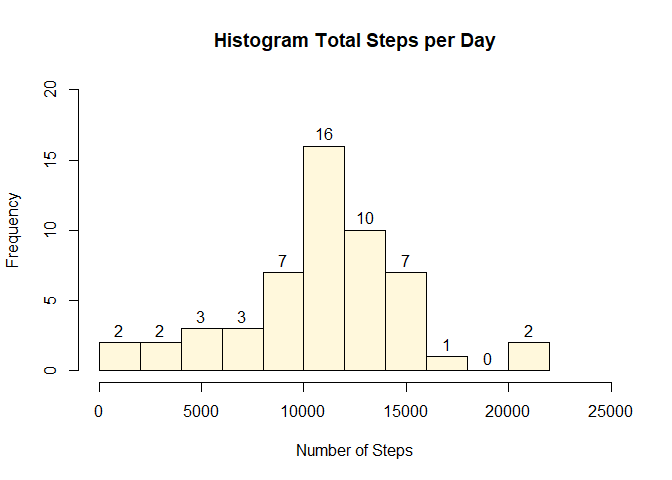
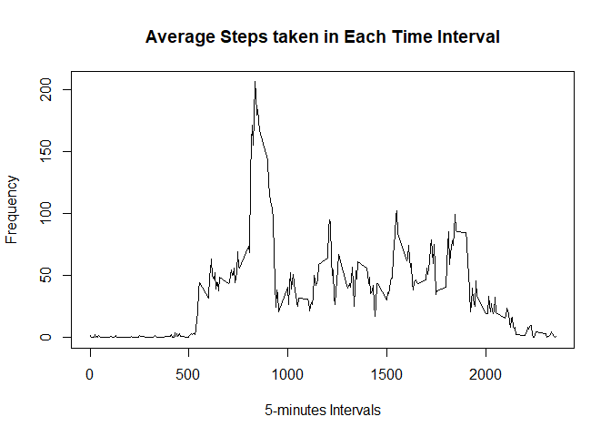
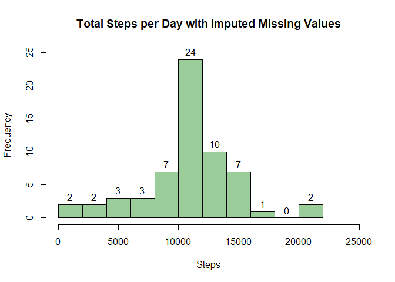
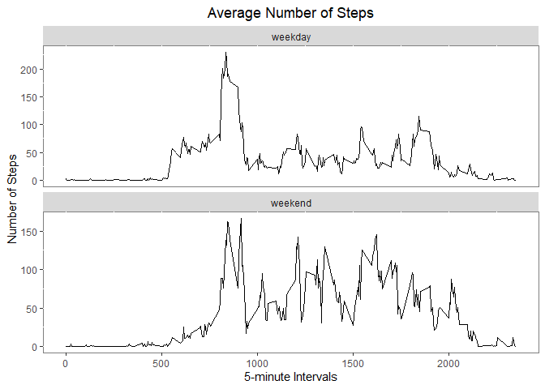

Author: Lawrence Brown

Date: 23 Dec 2020

## Loading and preprocessing the data

Load the data from activity.csv which is included in the zip file, activity.zip 
at the URL https://d396qusza40orc.cloudfront.net/repdata%2Fdata%2Factivity.zip

The variables included in this dataset are:

steps: Number of steps taking in a 5-minute interval (missing values are coded as NA
date: The date on which the measurement was taken in YYYY-MM-DD format
interval: Identifier for the 5-minute interval in which measurement was taken

The dataset is stored in a comma-separated-value (CSV) file and there are a total of 17,568 
observations in this dataset.

#### 1. Code for reading in the dataset and/or processing the data


```r
dfActivity <- read.table(unz("activity.zip", "activity.csv"), header=TRUE, sep=',')
print(head(dfActivity, 5))
```

```
##   steps       date interval
## 1    NA 2012-10-01        0
## 2    NA 2012-10-01        5
## 3    NA 2012-10-01       10
## 4    NA 2012-10-01       15
## 5    NA 2012-10-01       20
```

## What is mean total number of steps taken per day?

The mean total is determined by using the aggregate function on the steps, 
aggregated by the dates. 


#### 2. Histogram of the total number of steps taken each day

```r
# Sum up steps by date using aggregate function 
# Use setNames to lable the columns from the aggregation. 
dfTotalbyDay = setNames(aggregate(dfActivity$steps, by=list(dfActivity$date), FUN=sum),
                        c("date", "totalSteps")
                        )


# Plot the total number of steps per day as a Histogram using 10 bins
h1 <- hist(dfTotalbyDay$totalSteps,
                        breaks = 10, 
                        main='Histogram Total Steps per Day', 
                        xlim=c(0,25000),
                        ylim=c(0,20),
                        col='cornsilk', 
                        xlab='Number of Steps', 
                        ylab='Frequency'
                   )
# Place the counts on top of the histogram bars 
text(h1$mids,h1$counts,labels=h1$counts, adj=c(0.5, -0.5))
```

<!-- -->


#### 3. Mean and median number of steps taken each day


```r
# Calculate the mean and median of the total steps, removing missing values

mean_totalsteps = mean(dfTotalbyDay$totalSteps, na.rm = TRUE )
median_totalsteps = median(dfTotalbyDay$totalSteps, na.rm = TRUE )

sprintf("Mean total steps: %s", format(mean_totalsteps,big.mark=",",scientific=FALSE))
```

```
## [1] "Mean total steps: 10,766.19"
```

```r
sprintf("Median total steps: %s", format(median_totalsteps,big.mark=",",scientific=FALSE))
```

```
## [1] "Median total steps: 10,765"
```


## What is the average daily activity pattern?

The daily average activity is calculated by finding the mean number of steps in each
time interval for all days in the data set. 

#### 4. Time series plot of the average number of steps taken


```r
# Calculate the number of steps (activity) aggregating across all 
# 5-minute intervals
dfDailyActivity = setNames(aggregate(dfActivity$steps, 
                                     by=list(dfActivity$interval), 
                                     FUN=mean,
                                     na.rm=TRUE),
                           c("interval", "aveSteps")   # Label columns for results
                          )

print(head(dfDailyActivity, 5))
```

```
##   interval  aveSteps
## 1        0 1.7169811
## 2        5 0.3396226
## 3       10 0.1320755
## 4       15 0.1509434
## 5       20 0.0754717
```

```r
# Create line plot
plot(dfDailyActivity, type='l',
                      xlab='5-minutes Intervals', 
                      ylab='Frequency',
                      main='Average Steps taken in Each Time Interval'
                      )
```

<!-- -->


Which 5-minute interval, on average across all the days in the dataset, contains the maximum number of steps?

#### 5. The 5-minute interval that, on average, contains the maximum number of steps


```r
# Determine which row has the maximum average Steps, the select the 
# corresponding interval in Column 1

intervalMaxSteps = dfDailyActivity[ which.max(dfDailyActivity$aveSteps), 1]

sprintf("5 min interval with maxium steps: %d", intervalMaxSteps)
```

```
## [1] "5 min interval with maxium steps: 835"
```

## Imputing missing values


Calculate and report the total number of missing values in the dataset (i.e. the total number of rows with NAs)

Devise a strategy for filling in all of the missing values in the dataset. The strategy does not need to be sophisticated. For example, you could use the mean/median for that day, or the mean for that 5-minute interval, etc.


```r
# Check number of missing values before replacement
count = sum(is.na(dfActivity$steps))
sprintf("Number of missing step values: %d", count)
```

```
## [1] "Number of missing step values: 2304"
```

#### 6. Code to describe and show a strategy for imputing missing data

The strategy for replacing missing values is to replace NA for a particular time interval
with the average number of steps for the time interval for all days.

Thus, the replaced value is what would be expected for the time interval of the day.


```r
# Use average daily steps in an interval (across all days) as a replacement 
# for NA
dfReplacement <- setNames( aggregate(dfActivity$steps, 
                                     by=list(dfActivity$interval), 
                                     FUN=mean,
                                     na.rm=TRUE),
                           c("interval", "aveSteps"))

# Create a new dataframe and replace NA values
dfActivityNoNA <- dfActivity

sprintf("Number of NA Before:  %d", sum(is.na(dfActivityNoNA$steps)))
```

```
## [1] "Number of NA Before:  2304"
```

```r
# Loop over all rows, checking if a missing value.  If missing,
# replace with the value in dfReplacement for the interval value 

for(i in 1:nrow(dfActivityNoNA)) {       # for-loop over rows
     if (is.na(dfActivityNoNA[i, 1])) {  # if step value for row i is NA
          # Replacement value is the aveSteps in dfReplacement 
          # for the interval value found in DfActivityNoNA
          replacement_value <- dfReplacement[dfReplacement$interval == dfActivityNoNA[i,3], 2]
          dfActivityNoNA[i,1] <- replacement_value
          replacement_value     
     }
}

# Check the number of missing values in the dataset after replacement
sprintf("Number of NA After:  %d", sum(is.na(dfActivityNoNA$steps)))
```

```
## [1] "Number of NA After:  0"
```

#### 7. Histogram of the total number of steps taken each day after missing values are imputed

Following is a histogram of the total number of steps taken each day, along with the the mean and median total number of steps taken per day. 

```r
# On the new dataset with NA replaced, calculate the total steps 
# aggregating across all days

dfTotalbyDayNoNA = setNames(aggregate(dfActivityNoNA$steps, 
                                      by=list(dfActivityNoNA$date), 
                                      FUN=sum),
                            c("date", "totalSteps")
                            )
print(head(dfTotalbyDayNoNA, 5))
```

```
##         date totalSteps
## 1 2012-10-01   10766.19
## 2 2012-10-02     126.00
## 3 2012-10-03   11352.00
## 4 2012-10-04   12116.00
## 5 2012-10-05   13294.00
```

```r
# Plot the Total steps as a histogram with a bin size of 10

h2 <- hist(dfTotalbyDayNoNA$totalSteps,
                            breaks = 10, 
                            main='Total Steps per Day with Imputed Missing Values', 
                            xlim=c(0,25000),
                            ylim=c(0,25),
                            col='darkseagreen3', 
                            xlab='Steps', 
                            ylab='Frequency'
                     )

# Label the histogram bars with the counts
text(h2$mids,h2$counts,labels=h2$counts, adj=c(0.5, -0.5))
```

<!-- -->

```r
# Calculate the mean and median total steps and report

mean_totalstepsNoNA = mean(dfTotalbyDayNoNA$totalSteps)
median_totalstepsNoNA = median(dfTotalbyDayNoNA$totalSteps)

sprintf("Mean total steps (with imputed missing values): %s", 
            format(mean_totalstepsNoNA,big.mark=",",scientific=FALSE))
```

```
## [1] "Mean total steps (with imputed missing values): 10,766.19"
```

```r
sprintf("Median total steps (with imputed missing values): %s", 
            format(median_totalstepsNoNA,big.mark=",",scientific=FALSE))
```

```
## [1] "Median total steps (with imputed missing values): 10,766.19"
```


Q:  Do these values differ from the estimates from the first part of the assignment? 
What is the impact of imputing missing data on the estimates of the total daily number of steps?

A:  Replacing the NA values resulted in 8 days of additional data for the histogram. The peak bin
has 24 observations versus 16 earlier. As the expected values were used to replace the 
missing values, the only bin that changed was the central bin (or average bin of histograms).  

The mean value before and after did not change (10,766.19).  However, the median shifted
closer to the mean when replacing the missing values. 

## Are there differences in activity patterns between weekdays and weekends?

#### 8. Panel plot comparing the average number of steps taken per 5-minute interval across weekdays and weekends


```r
# Create two new columns:
#  1) asDate - original text date converted to a Date value
#  2) weekflag - indicated weekday or weekend, initially set to weekday
dfActivityNoNA$asDate <- as.Date(dfActivityNoNA$date)
dfActivityNoNA$weekflag <- "weekday"

print(head(dfActivityNoNA))  #REMOVE
```

```
##       steps       date interval     asDate weekflag
## 1 1.7169811 2012-10-01        0 2012-10-01  weekday
## 2 0.3396226 2012-10-01        5 2012-10-01  weekday
## 3 0.1320755 2012-10-01       10 2012-10-01  weekday
## 4 0.1509434 2012-10-01       15 2012-10-01  weekday
## 5 0.0754717 2012-10-01       20 2012-10-01  weekday
## 6 2.0943396 2012-10-01       25 2012-10-01  weekday
```

```r
# Loop over the rows and if day is a weekend, then 
# change the 'week' value to weekend

for(i in 1:nrow(dfActivityNoNA)) {       # for-loop over rows
     if (grepl("S(at|un)", weekdays(dfActivityNoNA[i, 4]))) {
         dfActivityNoNA[i, 'weekflag'] <- "weekend"
     }
}

# Convert weekflag to factor (weekend, weekday) 
dfActivityNoNA$weekflag <- as.factor(dfActivityNoNA$weekflag)


# Calculate the mean number of steps for each time interval, 
# aggregating by interval and weekflag 

dfDayActivity = setNames(aggregate(dfActivityNoNA$steps, 
                                   by=list(dfActivityNoNA$interval, dfActivityNoNA$weekflag),
                                   FUN=mean),
                         c("interval", "weekflag", "aveSteps"))
```


```r
library(ggplot2)

# Create two stacked plots (facets) using the weekflag as separator

ggplot(dfDayActivity, aes(x=interval, y=aveSteps, fill=weekflag)) +
                      geom_line() +
                      facet_wrap(~weekflag, scales = 'free_y', nrow=2) +
                      labs(x = '5-minute Intervals',
                           y = 'Number of Steps',
                           title = 'Average Number of Steps') +
                      theme(legend.position = "none",
                            panel.background = element_rect(fill = "white", colour = "grey50"),
                            plot.title = element_text(hjust = 0.5))
```

<!-- -->

The results show, looking at the two graphs, that individuals are more active 
during the middle of the day on a weekend, relative to same time of day 
during the weekday. 
